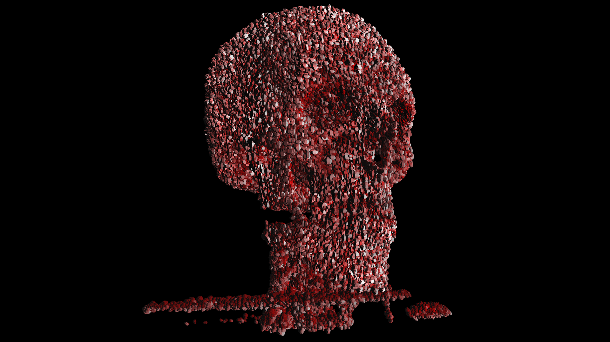
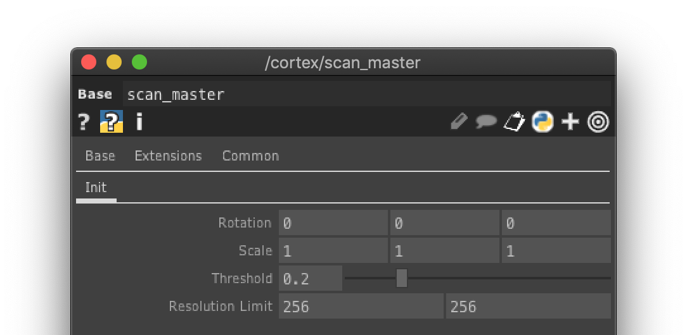
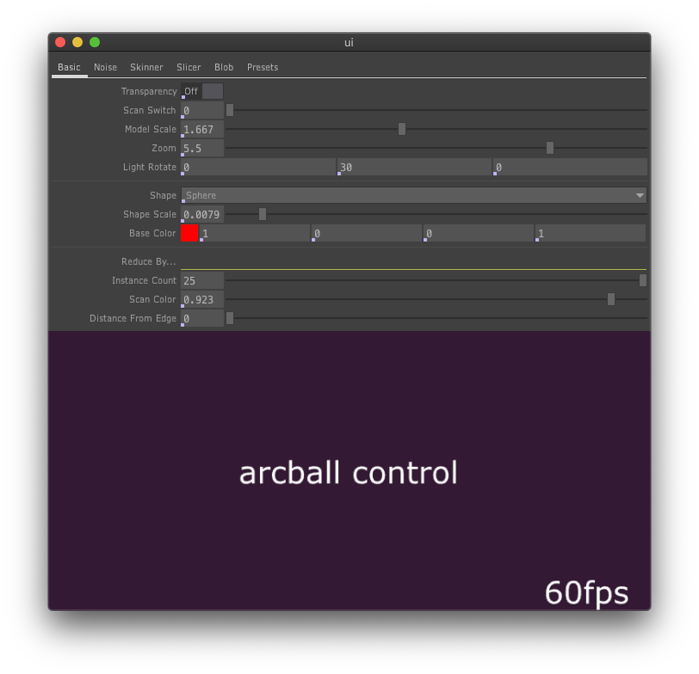

# [Cortex](https://vimeo.com/352195323)

This takes a collection of MRI scan slices and builds them into a voxelized model.

Comes preloaded with 3 sets of MRI scans, but you can add your own. Just use a Folder DAT to select the folder that has all the scan images and plug that into another copy of the Scan_Master tox component. Make sure your image file names are properly indexed so they get arranged in sequential order in the Folder DAT

Recommended that you use images no greater than 512x512px (but 4096x4096 is the highest supported), and 256x256 is the optimal size. This is because an instance is created per pixel of each scanned image, so if you have 256 images, each of 256x256px, the instances can quickly add up.

The Scan Master tox has a few parameters for setup:

* Rotation: This project assumes that the textures are sequenced from bottom to top (ex: shoulders to scalp), but if they're not you can use this parameter to correct the initial rotation position.
* Scale: sometimes you need to scale the model if it's squished or stretched to make it look right.
* Threshold: Controls how much of the initial mri picture you throw away so as to not create useless instances. Much of an MRI is black/empty, so this helps differentiate between the emptiness and a scanned body. "0" means everything is an instance (ie. your computer will catch fire). "1" most likely means nothing will be an instance. "0.2" is a pretty good starting point, but tweak it a bit if you find some scan information is missing. Within the Scan Master tox, check within any of the replicated Slice COMPs to see what effect Threshold has.
* Resolution Limit: Discussed above, but limits the resolution to this number, which also limits the instances created but also degrades the definition of the rendered model.

If you close the UI Control Window, you can launch it by ctrl+option+c. This window has control over basic parts of the model, can add effects to the model and can save and launch presets.

